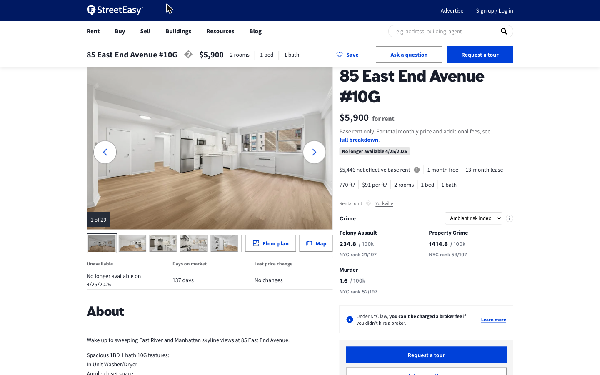
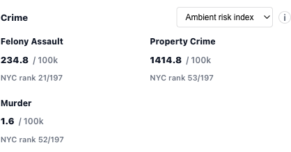
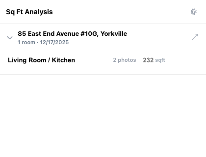
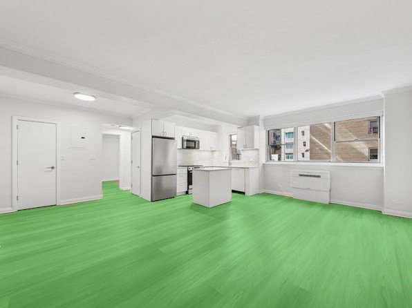
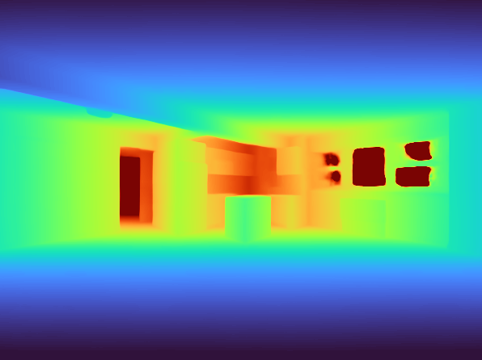
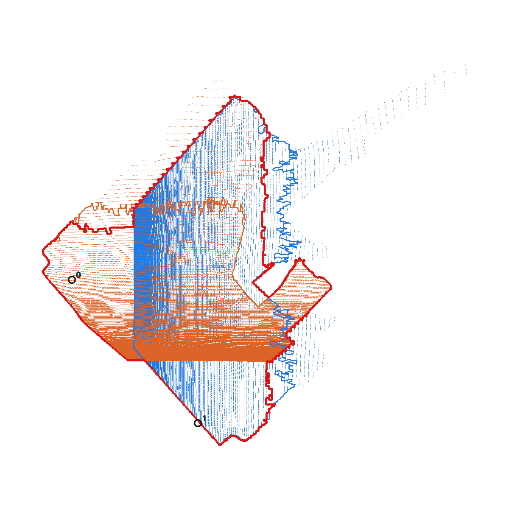

# SleepEasy

A Chrome extension that adds two things StreetEasy doesn't show you: **neighborhood crime context** and **AI-estimated room square footage** — computed from the listing's own photos, entirely on your machine.

**[Landing page](https://umqadir.github.io/streeteasy-enhanced-extension/)** · **[Latest release](https://github.com/umqadir/streeteasy-enhanced-extension/releases/latest)** · **[Research writeup](docs/RESEARCH.md)**



## Features

### Crime context, inline on every listing

A small module injected directly into StreetEasy NYC listing pages — designed to feel native, not bolted on. No setup, no account, no server: all data ships with the extension and every lookup happens in your browser.



- **Three metrics**: murder, felony assault, property crime (burglary + grand larceny + GLA of motor vehicle), from NYPD complaint data via NYC Open Data
- **Four measures**: ambient risk index (incidents per 100k people *present* — residents plus daytime workers, so business districts aren't distorted), per 100k residents, per square mile, and raw incident counts
- **Ranked**: each metric shows the neighborhood's rank and percentile across all 197 NYC NTAs
- **Accurate location**: coordinates come from StreetEasy's own Google Maps link, mapped to the official NYC Neighborhood Tabulation Area by client-side point-in-polygon — no geocoding, no network call

### Room square footage from listing photos

StreetEasy listings frequently omit square footage. SleepEasy's side panel lets you group listing photos into rooms and estimate each room's floor area with a computer-vision pipeline that runs on a **local backend** — photos are fetched and analyzed on your machine and never sent to a third-party service.



The pipeline: semantic segmentation isolates the floor, a metric-depth model recovers 3D geometry and camera intrinsics, a plane is fit to the floor points, and the visible floor area is measured in real-world units.

| Listing photo + floor segmentation | Metric depth | Fused top-down floor |
|---|---|---|
|  |  |  |

Two modes:

- **Multi-photo (default, needs an NVIDIA GPU)**: DUSt3R aligns the cameras of several photos of the same room, MoGe-2 floor geometry is fused across views — **5.4% error** on the benchmark room
- **Single-image (any machine, including Apple Silicon)**: SegFormer + MoGe-2 on one photo, measuring the visible floor — about **20% error**, biased low because only visible floor counts

See [docs/RESEARCH.md](docs/RESEARCH.md) for the full evaluation, including a 23-configuration benchmark and a licensing audit of commercially-usable model alternatives.

## Install

### Crime stats only (2 minutes, no dependencies)

1. Download `sleepeasy-extension.zip` from the [latest release](https://github.com/umqadir/streeteasy-enhanced-extension/releases/latest) and unzip it
2. Open `chrome://extensions`, enable **Developer mode** (top right)
3. Click **Load unpacked** and select the unzipped `extension` folder
4. Open any StreetEasy listing — the crime module appears under the listing details

### Room square footage (adds the local AI backend)

Requires [uv](https://docs.astral.sh/uv/getting-started/installation/) and ~4 GB of disk for model weights.

```bash
git clone https://github.com/umqadir/streeteasy-enhanced-extension.git
cd streeteasy-enhanced-extension/selfhost
bash scripts/install.sh        # creates the Python env, downloads models, runs checks
bash scripts/start_backend.sh  # serves http://127.0.0.1:8787
```

Load the extension from `selfhost/extension` (same Load-unpacked steps as above), open the SleepEasy side panel on a listing, and check the backend connection in settings. Machines without an NVIDIA GPU are prompted once to switch to single-image mode — everything works on CPU or Apple Silicon, just with the single-image accuracy tradeoff.

Full backend documentation, smoke tests, and troubleshooting: [selfhost/README.md](selfhost/README.md).

## How it works

```
┌────────────────────────────  Chrome  ─────────────────────────────┐
│  StreetEasy listing page                                          │
│  ├─ coordinates from the listing's Google Maps link               │
│  ├─ point-in-polygon → NYC NTA → precompiled crime stats (local)  │
│  └─ side panel: group photos into rooms                           │
└──────────────────────────────┬────────────────────────────────────┘
                               │ photo URLs (localhost only)
┌──────────────────────────────▼────────────────────────────────────┐
│  Local backend (Python, port 8787)                                │
│  segmentation (SegFormer) → metric depth + intrinsics (MoGe-2)    │
│  → floor plane RANSAC → area; multi-photo: DUSt3R camera fusion   │
└───────────────────────────────────────────────────────────────────┘
```

- Crime data is compiled offline from NYC Open Data ([NYPD complaints](https://data.cityofnewyork.us/Public-Safety/NYPD-Complaint-Data-Historic/qgea-i56i), NTA boundaries, 2020 Census population, LODES workplace counts) by `scripts/compile-data.js` and `scripts/compile-nta-exposure.py`, and ships as static JSON inside the extension. Current data covers a 24-month window through September 30, 2025.
- The sqft backend is a dependency-free Python HTTP server (`selfhost/backend/local_backend.py`) wrapping the v2 estimation pipeline (`selfhost/v2-pipeline/estimate_v2b.py`).

## Accuracy, honestly

Quantitative evaluation is against one professionally-photographed benchmark room with known dimensions (266 sqft), plus 23 labeled listings collected for future evaluation. Headline numbers:

| Pipeline | Estimate | Error |
|---|---:|---:|
| Multi-photo (DUSt3R camera fusion + MoGe-2 floor) | 251.6 sqft | **5.4%** |
| Single-image (SegFormer + MoGe-2, visible floor) | 213.2 sqft | 19.9% |

Single-image estimates measure *visible* floor area, so they read low for shots that crop the room. Treat estimates as a sanity check on a listing's claims, not as gospel. The full benchmark matrix (23 configurations across segmentation, depth, plane-fitting, and boundary-estimation variants) is in [docs/RESEARCH.md](docs/RESEARCH.md).

## Repository layout

| Path | Contents |
|---|---|
| `selfhost/` | The release bundle: extension, local backend, pipeline, install scripts |
| `sqft-from-photos/` | CV research: pipelines, benchmark harness, eval dataset, licensing audit |
| `launch/` | Landing page (deployed to GitHub Pages) |
| `scripts/` | Crime-data compilation utilities (NYC Open Data → extension JSON) |
| `docs/` | Research writeup, images, debug map for exploring the crime data |
| `research/backend-archived/` | Earlier server-based architecture, kept for reference |

## Privacy

- Crime stats: fully client-side; no requests leave the browser
- Sqft estimation: the extension talks only to `127.0.0.1`; the local backend downloads listing photos directly from the listing's CDN and analyzes them on your machine
- No accounts, no analytics, no tracking of any kind

## License and attribution

This project is [MIT licensed](LICENSE). It builds on:

- [DUSt3R](https://github.com/naver/dust3r) (Naver) — **CC BY-NC-SA 4.0, non-commercial**; used by the default multi-photo mode, which is why this project is distributed as a free, self-hosted tool
- [MoGe-2](https://github.com/microsoft/MoGe) (Microsoft) — MIT
- [SegFormer](https://huggingface.co/nvidia/segformer-b5-finetuned-ade-640-640) (NVIDIA) — research license
- NYPD complaint data, NTA boundaries, Census 2020, and LODES via [NYC Open Data](https://opendata.cityofnewyork.us/) / U.S. Census Bureau

SleepEasy is an independent project, not affiliated with or endorsed by StreetEasy, Zillow Group, the NYPD, or the City of New York. Crime statistics are informational; past incidence does not predict future safety.
